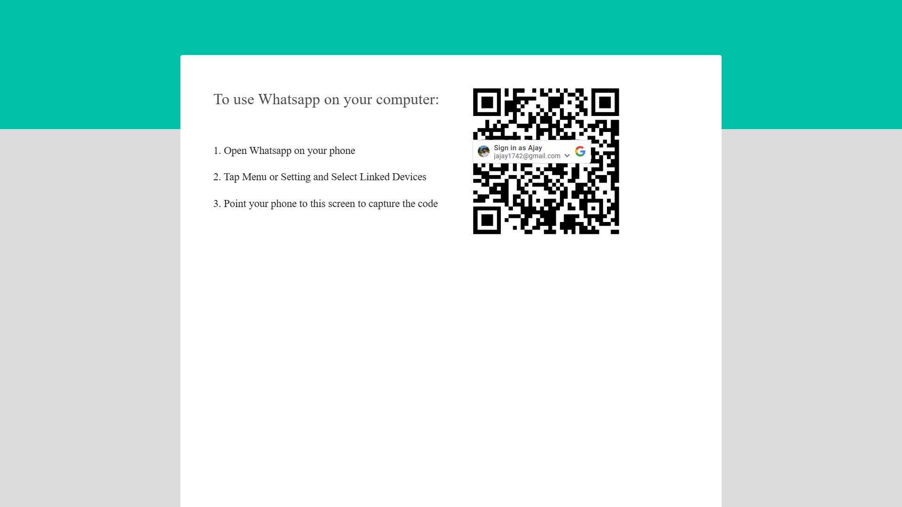
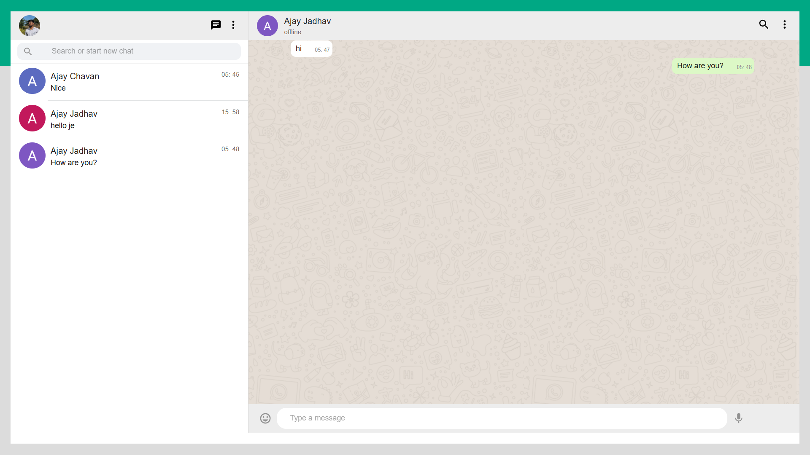

<h1 align="center">✨💬 Chatterly – Real-Time Chat App</h1>

<p align="center">
  <b>A modern, responsive real-time chat application with Google Authentication and Socket.IO.</b>
</p>

<p align="center">
  
  
  
</p>

---

## 📖 Overview

Chatterly is a **real-time chat platform** built using **MERN** (MongoDB, Express.js, React, Node.js) and **Socket.IO**.
It allows users to log in via **Google Authentication**, chat instantly with friends, share files, and view user presence.
Its clean, mobile-friendly interface makes chatting simple and engaging.

---

## ✨ Features

* 🔑 **Google OAuth 2.0 Authentication** – Easy and secure login.
* ⚡ **Real-Time Messaging** – Instant communication using Socket.IO.
* 🟢 **User Presence** – See who’s online or offline in real-time.
* 📂 **File Sharing** – Send images or documents directly.
* 📱 **Responsive Design** – Optimized for mobile and desktop.
* 🚀 **Deployed & Scalable** – Frontend on Netlify, Backend & Socket server on Render.

---

## 🛠 Tech Stack

| **Frontend**       | **Backend**         | **Database** | **Real-Time** | **Deployment**  |
| ------------------ | ------------------- | ------------ | ------------- | --------------- |
| React, Vite, Axios | Node.js, Express.js | MongoDB      | Socket.IO     | Netlify, Render |

---
## 🌐 **Live Demo**

<div align="center">

🚀 **Explore Chatterly in Action**  
Click the links below to experience the live versions of each service:  

| 🔗 **Service**       | 🌟 **URL**                                                                 |
|----------------------|---------------------------------------------------------------------------|
| 🎨 **Frontend**       | [](https://chatterllly.netlify.app) |
| 🛠 **Backend API**    | [](https://chatterly-backend1.onrender.com) |
| ⚡ **Socket Server**  | [](https://chatterly-socketio.onrender.com) |

</div>

---

## 🖼 Screenshots

<p align="center">
  
  
</p>

---

## ⚙️ Installation

### 1️⃣ Clone the Repository

```bash
git clone https://github.com/ajay70jadhav/Chatterly.git
cd Chatterly
```

### 2️⃣ Install Dependencies

#### Backend

```bash
cd server
npm install
```

#### Socket Server

```bash
cd ../socket
npm install
```

#### Frontend

```bash
cd ../client
npm install
```

---

## 🚀 Usage

### Start Backend

```bash
cd server
npm start
```

### Start Socket Server

```bash
cd ../socket
npm start
```

### Start Frontend

```bash
cd ../client
npm start
```

Then open 👉 **[http://localhost:5173](http://localhost:5173)** in your browser.

---

## 🤝 Contributing

We welcome contributions!

1. Fork this repository.
2. Create a new branch:

   ```bash
   git checkout -b feature-name
   ```
3. Commit your changes:

   ```bash
   git commit -m "Added new feature"
   ```
4. Push to your branch:

   ```bash
   git push origin feature-name
   ```
5. Open a Pull Request 🎉

---

## 📝 License

This project is licensed under the [MIT License](LICENSE).
You’re free to use, modify, and distribute this software.

---

## 📬 Contact

👤 **Ajay Gulab Jadhav**
📧 Email: [jajay1742@gmail.com](mailto:jajay1742@gmail.com)
🌐 Portfolio: [portfolio-ajay-jadhav.netlify.app](https://portfolio-ajay-jadhav.netlify.app/)
🐙 GitHub: [ajay70jadhav](https://github.com/ajay70jadhav)
💼 LinkedIn: [ajay-jadhav](https://www.linkedin.com/in/ajay-jadhav-6652a3228/)

---

<p align="center">
  Made with ❤️ by <a href="https://github.com/ajay70jadhav">Ajay Jadhav</a>
</p>
